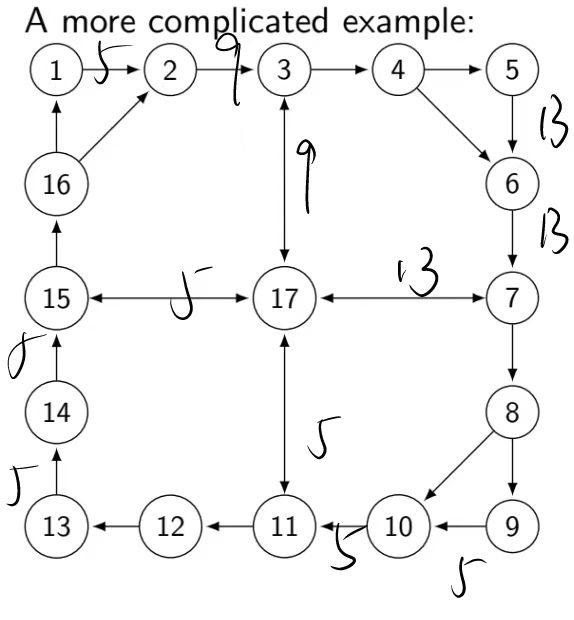
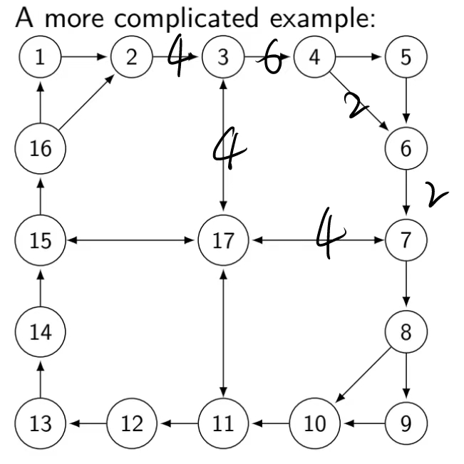

# 大作业

NuSMV死锁验证

# 主要流程

使用python读入图数据，然后按照图结构计算每个节点关于每条出边的OK集合，然后按照“主节点可以收发”对相应的channel生成相应smv代码，对于所有节点相关的channel生成process处理，生成smv后用NuSMV进行验证

# 使用

`python gen.py <input graph> [<output NuSMV file>]`，其中最后一个参数可省略，默认生成`gen.smv`

python版本为3.9.6

# 详细说明

## 输入图限制

以`graph_test.txt`为例

```
4
1 2 3
1 2
2 3
3 4
4 1
```

其中第一行为节点数量N，第二行为主节点的标号序列M，后续每一行为一条有向边`src dst`，src为源节点，dst为目标节点。

其中标号必须按照1..N进行标号，不能有自回路节点(即自己指向自己)，同时不能包含重边(即不能包含两条及以上的`src dst`边)，可以有`src dst`,`dst src`边同时存在

## 翻译图至NuSMV说明

在读入图数据`read_graph`之后，生成相应的有向图结构。

### 类OK(n, m, c)集合

然后通过最短路径计算`node.calc_shortest_paths`得到类似于OK(n, m, c)的集合。

具体来说，就是对每个节点n，对于其他可达节点，都生成相应的可供选择发送消息的信道chan，记录到`ok_set`中，`ok_set`是一个`Dict[Node, set]`类型的字典，对于每一个要发送到目标节点dst的消息，都可以通过`ok_set`字典得到能够被选择用来发送该消息的信道集合`ok_set[dst]`

### VAR, INIT

然后对于所有信道，生成相应的`VAR,INIT`代码(相应代码为`genModuleVarInit`,`genVar`,`genInit`)

如果一个信道是单向的，那么它的名称为`c{src}_{dst}`，例如1节点到2节点，则为`c1_2`。如果信道是双向的，那么它的名称为`c{src}_{dst}b`，其中b表示双向含义。

对于所有信道，其初始值都是0

### TRANS

然后是生成`TRANS`和`CTLSPEC`

`TRANS`是很多条件的析取

### send

首先是发送`genSend`

对于主节点序列M中的每一个节点src，对于其他主节点dest，在可以被选择发送的信道`ok_channel`上产生发送代码

例如

```
(case c1_2 = 0: next(c1_2) = 3;
	TRUE: next(c1_2) = c1_2;
esac) & next(c2_3)=c2_3 & next(c3_4)=c3_4 & next(c4_1)=c4_1 |
```

表示1->2发送消息3，其他保持不变

### recv

然后是接受`genRecv`

对于主节点序列M中的每一个节点node，对于其入边，生成相应的接受代码

例如

```
(case c1_2 = 2: next(c1_2) = 0;
	TRUE: next(c1_2) = c1_2;
esac) & next(c2_3)=c2_3 & next(c3_4)=c3_4 & next(c4_1)=c4_1 |
```

表示1->2信道上有消息2，2从中接受消息，其他保持不变

### process

然后是处理`genProcess`

对于所有节点node,对于所有主节点dest，对于所有能够被选择用来发送消息dest的出边out_chan以及能够被选择用来发送消息dest的入边，生成相应的处理代码

例如

```
(case c4_1 = 3 & c1_2 = 0: next(c4_1)=0 & next(c1_2)=3 ;
	TRUE: next(c4_1)=c4_1 & next(c1_2)=c1_2 ;
esac) & next(c2_3)=c2_3 & next(c3_4)=c3_4 |
```

表示4->1上有3,1->2上为0，然后1->2可以被选择用来传递消息3，因此进行了一次处理，其他保持不变

### CTLSPEC

在生成`TRANS`的过程中，记录case语句的条件，然后在CTLSPEC中析取生成Q，死锁条件D=!Q，不存在未来死锁为!EF D，然后生成相应的代码

例如

```
CTLSPEC !EF!(
	(c1_2 = 0) |
	(c2_3 = 0) |
	(c3_4 = 0) |
	(c4_1 = 1) |
	(c1_2 = 2) |
	(c2_3 = 3) |
	(c4_1 = 2 & c1_2 = 0) |
	(c4_1 = 3 & c1_2 = 0) |
	(c1_2 = 3 & c2_3 = 0) |
	(c2_3 = 1 & c3_4 = 0) |
	(c3_4 = 1 & c4_1 = 0) |
	(c3_4 = 2 & c4_1 = 0) 
)
```

# 验证

## 对于PPT中1,2,3,4的小例子进行验证

输入文件为`graph_test.txt`，已经生成的NuSMV文件为`graph_test.smv`

输出为

```
  -> State: 1.1 <-
    c1_2 = 0
    c2_3 = 0
    c3_4 = 0
    c4_1 = 0
  -> State: 1.2 <-
    c1_2 = 3
  -> State: 1.3 <-
    c2_3 = 1
  -> State: 1.4 <-
    c3_4 = 2
  -> State: 1.5 <-
    c3_4 = 0
    c4_1 = 2
  -> State: 1.6 <-
    c3_4 = 1
```

表示1->2上发送消息3，2->3上发送消息1，3->4上发送消息2，然后进行处理4节点进行转发，4->1为2，然后3->4上发送消息1，次数没有节点能够进行接受，所有节点状态无法改变，因此死锁

## 对于complicated example的M={1,5,9,13}的验证

输入文件为`graph.txt`，已经生成的NuSMV文件为`graph.smv`

此时也会产生死锁

```
  -> State: 1.1 <-
    c1_2 = 0
    c2_3 = 0
    c3_4 = 0
    c3_17b = 0
    c4_5 = 0
    c4_6 = 0
    c5_6 = 0
    c6_7 = 0
    c7_8 = 0
    c7_17b = 0
    c8_9 = 0
    c8_10 = 0
    c9_10 = 0
    c10_11 = 0
    c11_12 = 0
    c11_17b = 0
    c12_13 = 0
    c13_14 = 0
    c14_15 = 0
    c15_16 = 0
    c15_17b = 0
    c16_1 = 0
    c16_2 = 0
  -> State: 1.2 <-
    c1_2 = 9
  -> State: 1.3 <-
    c1_2 = 0
    c2_3 = 9
  -> State: 1.4 <-
    c1_2 = 9
  -> State: 1.5 <-
    c2_3 = 0
    c3_17b = 9
  -> State: 1.6 <-
    c1_2 = 0
    c2_3 = 9
  -> State: 1.7 <-
    c1_2 = 5
  -> State: 1.8 <-
    c5_6 = 13
  -> State: 1.9 <-
    c5_6 = 0
    c6_7 = 13
  -> State: 1.10 <-
    c5_6 = 13
  -> State: 1.11 <-
    c6_7 = 0
    c7_17b = 13
  -> State: 1.12 <-
    c5_6 = 0
    c6_7 = 13
  -> State: 1.13 <-
    c5_6 = 13
  -> State: 1.14 <-
    c9_10 = 5
  -> State: 1.15 <-
    c9_10 = 0
    c10_11 = 5
  -> State: 1.16 <-
    c9_10 = 5
  -> State: 1.17 <-
    c10_11 = 0
    c11_17b = 5
  -> State: 1.18 <-
    c9_10 = 0
    c10_11 = 5
  -> State: 1.19 <-
    c9_10 = 5
  -> State: 1.20 <-
    c13_14 = 5
  -> State: 1.21 <-
    c13_14 = 0
    c14_15 = 5
  -> State: 1.22 <-
    c13_14 = 5
  -> State: 1.23 <-
    c14_15 = 0
    c15_17b = 5
  -> State: 1.24 <-
    c13_14 = 0
    c14_15 = 5
  -> State: 1.25 <-
    c13_14 = 5
```

最后死锁结果如下图所示



## 对于complicated example的M={2,4,6}的验证

输入文件为`graph2.txt`，已经生成的NuSMV文件为`graph2.smv`

此时会产生死锁

```
  -> State: 1.1 <-
    c1_2 = 0
    c2_3 = 0
    c3_4 = 0
    c3_17b = 0
    c4_5 = 0
    c4_6 = 0
    c5_6 = 0
    c6_7 = 0
    c7_8 = 0
    c7_17b = 0
    c8_9 = 0
    c8_10 = 0
    c9_10 = 0
    c10_11 = 0
    c11_12 = 0
    c11_17b = 0
    c12_13 = 0
    c13_14 = 0
    c14_15 = 0
    c15_16 = 0
    c15_17b = 0
    c16_1 = 0
    c16_2 = 0
  -> State: 1.2 <-
    c2_3 = 6
  -> State: 1.3 <-
    c2_3 = 0
    c3_4 = 6
  -> State: 1.4 <-
    c2_3 = 4
  -> State: 1.5 <-
    c6_7 = 4
  -> State: 1.6 <-
    c6_7 = 0
    c7_17b = 4
  -> State: 1.7 <-
    c3_17b = 4
    c7_17b = 0
  -> State: 1.8 <-
    c4_6 = 2
  -> State: 1.9 <-
    c6_7 = 4
  -> State: 1.10 <-
    c6_7 = 0
    c7_17b = 4
  -> State: 1.11 <-
    c6_7 = 2
```

死锁结果如下图



# 总结

通过自动生成代码的方式对图进行死锁验证。理论上对于满足要求的图输入都可以进行验证
